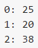

# javascript-helper
a compilation of many useful codes, frequently used in JavaScript, plus much more

# Random ID generator:
Generate a random string of a defined length (5 by default). To change the default length just change the value of "defaultRandomIdLength" anywhere before calling this function.

    function:   randomId
    parameter:  charlen (Length of the ID)
    usage:      var newID = randomId(10); // "yUuVpC6E4q"

# Unique Random ID generator:
This function will generate an unique random string of a defined length, each time it's called.

    function:   uniqueRandomId
    parameter:  charlen (Length of the ID)
    usage:
                var newID1 = uniqueRandomId(10); // "SBs58FoVLm"
                var newID2 = uniqueRandomId(10); // "3i6fG6B1BN"
                var newID3 = uniqueRandomId(10); // "RxXqQi8STj"

# Arrray functions
Extra *Array* functions not available always

## forEach
Loops through each element of an array & perform a handler operation. 

    function:   Array.forEach
    parameter:  handler (the handler function)
                    parameter:  elem    (Each Element)
                                index   (Current Index)
                                arr     (Whole Array)
                thisArg (optional "this" value passed to handler function)
    usage:
                var container = $("#SomeDivToShow")
                var Arr = [25, 20, 38];
                Arr.forEach(function(elem, i, arr){
                    $("").text(i.toString()+': '+elem.toString()).appendTo(this);
                    this.append(" ");
                }, container);
###Result
>>>

