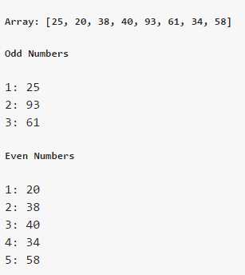
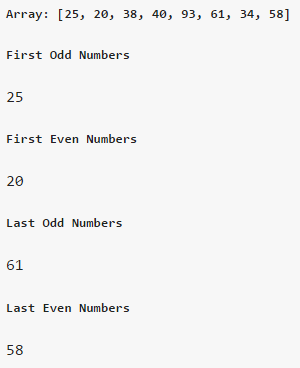
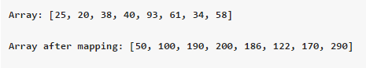
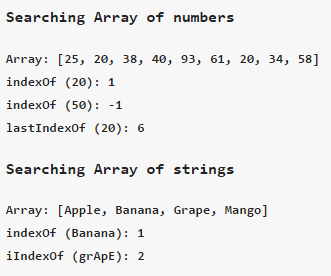

# javascript-helper
a compilation of many useful codes, frequently used in JavaScript, plus much more.

# Check for IE:
I know how It is a big pain in the a$$ to work with IE (our beloved "Internet Explorer").
Hence, here is a function to determine IE version (which returns the IE version if it's IE or returns 0 if it's not)
and one boolean variable "isIE" for the sake of life & countless sleepless hours of the Developers.

    function:   msieversion
    parameter:  NONE
    returns:    integer (the version of the IE currently running or 0 if it's not IE)
    usage:      var curIEVersion = msieversion(10); // 8

    variable:   isIE
    type:       boolean
    usage:      if(isIE) {
                    // write IE specific code... X-(
                }
                else {
                    // write generic browser code :-)
                }

# Random ID generator:
Generate a random string of a defined length (5 by default). 
To change the default length just change the value of "defaultRandomIdLength" anywhere before calling this function.

    function:   randomId
    parameter:  charlen (Length of the ID)
    returns:    string
    usage:      var newID = randomId(10); // "yUuVpC6E4q"
Note: you can add any additional characters in the "randomCharset" variable if you want them to be included in the generated id

    e.g.:      randomCharset += 'áāćÃȱɜ';

# Unique Random ID generator:
This function will generate an unique random string of a defined length, each time it's called.

    function:   uniqueRandomId
    parameter:  charlen (Length of the ID)
    returns:    string
    usage:
                var newID1 = uniqueRandomId(10); // "SBs58FoVLm"
                var newID2 = uniqueRandomId(10); // "3i6fG6B1BN"
                var newID3 = uniqueRandomId(10); // "RxXqQi8STj"

# Arrray functions
Extra *Array* functions not available always

#### isArray
Determines if an object is an Array type. [This one](http://perfectionkills.com/instanceof-considered-harmful-or-how-to-write-a-robust-isarray/) really helps/kills me to understand. 

    function:   isArray
    parameter:  o (a javascript object)
    returns:    boolean (whether the given object is an Array)
    usage:
                var arr = [1, 2, 3];
                var noArr = "Abcd";
                var result1 = isArray(arr); // true
                var result2 = isArray(noArr); // false

#### forEach
Loops through each element of an array & perform a handler operation.

NOTE: this function does not modify the original array.

    function:   Array.forEach
    parameter:  handler (the handler function)
                    parameter:  elem    (Each Element)
                                index   (Current Index)
                                arr     (Whole Array)
                thisArg (optional "this" value passed to handler function)
    returns:    array (the original array. It can be used as a chain command. e.g. [1, 2, 3].forEach(...).forEach(...))
    usage:
                var container = $("#SomeDivToShow")
                var Arr = [25, 20, 38];
                Arr.forEach(function(elem, i, arr){
                    $("").text(i.toString()+': '+elem.toString()).appendTo(this);
                    this.append(" ");
                }, container);
#####Result

#### filter
Loops through each element of an array & performs a handler operation with filter conditions. 
This function does not take null/empty array elements into consideration & hence, 
they are filtered out by default. 
The filter handler function must return 
    1. true or
    2. a non-zero (0) number or 
    3. a non-null object 
to determine, whether the array object in the current loop, should be included in the output Array.

NOTE: this function does not modify the original array.

    function:   Array.filter
    parameter:  handler (the handler function)
                    parameter:  elem    (Each Element)
                                index   (Current Index)
                                arr     (Whole Array)
                thisArg (optional "this" value passed to handler function)
    returns:    array (the array after the filtration completes)
    usage:
                var container = $("#SomeDivToShow")
                var Arr = [25, 20, 38, 40, 93, 61, 34, 58];
                container.append("<h5>Array: ["+Arr.join(', ')+"]</h5>");
                // Filters all odd numbers
                container.append("<h5>Odd Numbers</h5>");
                Arr.filter(function(elem, i, arr){
                    return elem % 2;
                }).forEach(function(elem, i, arr){
                    $("").text((i+1).toString()+': '+elem.toString()).appendTo(this);
                    this.append(" ");
                }, container);
                // Filters all even numbers
                container.append("<h5>Even Numbers</h5>");
                Arr.filter(function(elem, i, arr){
                    return ((elem % 2) === 0);
                }).forEach(function(elem, i, arr){
                    $("").text((i+1).toString()+': '+elem.toString()).appendTo(this);
                    this.append(" ");
                }, container);
#####Result

#### filterFirst & filterLast
Works the same way as filter, but returns the first element that matches, instead of an array. 

NOTE: this function does not modify the original array.

    function:   Array.filterFirst & Array.filterLast
    parameter:  handler (the handler function)
                    parameter:  elem    (Each Element)
                                index   (Current Index)
                                arr     (Whole Array)
                thisArg (optional "this" value passed to handler function)
    returns:    array (the array after the filtration completes)
    usage:      var container = $("#SomeDivToShow")
                var Arr = [25, 20, 38, 40, 93, 61, 34, 58];
                container.append("<h5>Array: ["+Arr.join(', ')+"]</h5>");
                // Filters First odd numbers
                container.append("<h5>First Odd Numbers</h5>");
                var resultOdd = Arr.filterFirst(function(elem, i, arr){
                    return elem % 2;
                });
                $("").text(resultOdd.toString()).appendTo(container);
                container.append(" ");
                
                // Filters First even numbers
                container.append("<h5>First Even Numbers</h5>");
                var resultEven = Arr.filterFirst(function(elem, i, arr){
                    return ((elem % 2) === 0);
                });
                $("").text(resultEven.toString()).appendTo(container);
                container.append(" ");
#####Result

#### map
Apply custom functions on each element of an Array. As depicted in https://developer.mozilla.org/en-US/docs/Web/JavaScript/Reference/Global_Objects/Array/map

NOTE: **this function _modifies_ the original array**

    function:   Array.map
    parameter:  handler (the handler function)
                    parameter:  elem    (Each Element)
                                index   (Current Index)
                                arr     (Whole Array)
                thisArg (optional "this" value passed to handler function)
    returns:    array (the array after the mapping completes)
    usage:      var container = $("#SomeDivToShow")
                var Arr = [25, 20, 38, 40, 93, 61, 34, 58];
                container.append("<h5>Array: ["+Arr.join(', ')+"]</h5>");
                container.append("<h5>Array after mapping: ["+Arr.map(function(elem, i, arr){
                    return ((elem % 2) ? (elem * 2) : (elem * 5));
                }).join(', ')+"]</h5>");
#####Result

#### indexOf, lastIndexOf, iIndexOf & iLastIndexOf
Get the 0 based index of the occurrence of an item in an Array. -1 is returned if not found. 
*lastIndexOf* searches the Array from tail-end. 

*iIndexOf* & *iLastIndexOf* are the case-insensitive version.

    function:   Array.indexOf, Array.lastIndexOf, Array.iIndexOf & Array.iLastIndexOf
    parameter:  searchItem (an item to search. May be number or string or an object etc.)
    returns:    int (the 0 based index if found, -1 instead)
    usage:      var container = $("#SomeDivToShow")
                var Arr = [25, 20, 38, 40, 93, 61, 20, 34, 58];
                container.append("<h4>Searching Array of numbers</h4>");
                container.append("<h5>Array: ["+Arr.join(', ')+"]</h5>");
                // Find First occurrence
                var searchItem = 20;
                container.append("<h5>indexOf ("+searchItem.toString()+"): "+Arr.indexOf(searchItem).toString()+"</h5>");
                container.append("<h5>indexOf ("+(50).toString()+"): "+Arr.indexOf(50).toString()+"</h5>");
                // Find Last occurrence
                container.append("<h5>lastIndexOf ("+searchItem.toString()+"): "+Arr.lastIndexOf(searchItem).toString()+"</h5>");
                Arr = ["Apple", "Banana", "Grape", "Mango"];
                container.append("<h4>Searching Array of strings</h4>");
                container.append("<h5>Array: ["+Arr.join(', ')+"]</h5>");
                // Exact string search
                var searchItem = "Banana";
                container.append("<h5>indexOf ("+searchItem+"): "+Arr.indexOf(searchItem).toString()+"</h5>");
                // Case-insensitive string search
                searchItem = "grApE";
                container.append("<h5>iIndexOf ("+searchItem+"): "+Arr.iIndexOf(searchItem).toString()+"</h5>");
#####Result

